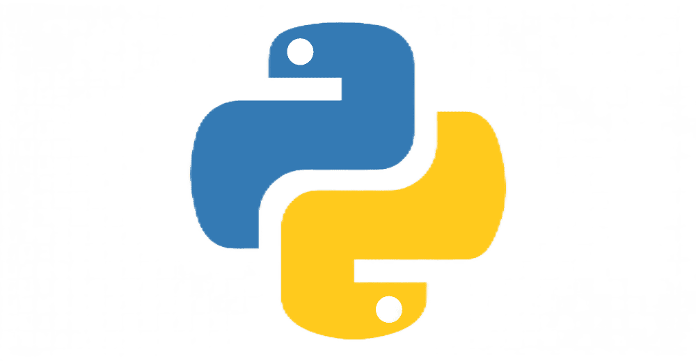

# **Привет**!

## Меня зовут Александр, мне 27 лет!

## C 8 декабря 2022 являюсь студентом [**Netologia** ](https://netology.ru)

## Учусь на курсе [**Python**-*разработчик с нуля*](https://netology.ru/programs/python?recommended_by=instant_search)
___

С момента написания своего первого

```python 
print('Hello world!')
```
прошло равно 2 месяца.

### За это время я освоил такие темы как:
- [x] Основы языка программирования Python.
- [x] Git — система контроля версий.

## Почему я выбрал Нетологию?

- Цена, наличие/размер скидки
- Наличие лицензии / выдача диплома
- Известность Нетологии
